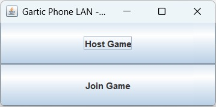


# 🎨 Game2D Gartic Phone LAN (Kelompok: Indra, Sapto, Erin, Izmi)


Selamat datang di repository **Game2D Gartic Phone LAN**! 🚀
Proyek ini adalah adaptasi _Gartic Phone_ berbasis Java yang dapat dimainkan secara LAN (Local Area Network).
Game ini dibuat oleh: **Indra**, **Sapto**, **Erin**, **Izmi**.

---

## 🕹️ Fitur Utama

- 🎮 **Multiplayer LAN**: Mainkan bersama teman-teman dalam satu jaringan lokal.
- ✍️ **Input Kalimat & Gambar**: Bergantian menulis kalimat, menggambar, dan menebak.
- 🔄 **Game Cycle**: Urutan text → gambar → tebak gambar, berulang sesuai jumlah pemain.
- 🧑‍🤝‍🧑 **Tab Hasil Replay**: Lihat rangkaian hasil tiap pemain dalam tampilan _bubble chat_.
- ⏰ **Timer**: Batas waktu untuk menggambar dan menebak.
- 📤 **Export**: Ekspor hasil _chain_ ke format PNG dengan satu klik.
- 💬 **User-friendly UI**: Tampilan dengan nama pemain, status submit, dan progress.

---

## 📦 Struktur Folder

```
├── client/        # Kode client (UI, koneksi)
├── server/        # Kode server (logic, komunikasi)
├── shared/        # Model data GameMessage & PlayerData
├── assets/        # Gambar & ikon (jika ada)
├── README.md
```

---

## ⚡ Cara Menjalankan

1. **Clone repo ini**
   ```bash
   git clone https://github.com/your-username/game2d-kelompok-indra-sapto-erin-izmi.git
   cd game2d-kelompok-indra-sapto-erin-izmi
   ```

2. **Build dan Run Server**
   ```bash
   cd server
   javac -cp .:../shared com/gartic/main/server/GameServer.java
   java com.gartic.main.server.GameServer
   ```

3. **Build dan Run Client**
   ```bash
   cd client
   javac -cp .:../shared com/gartic/main/client/Launcher.java
   java com.gartic.main.client.Launcher
   ```

4. **Ikuti instruksi pada UI. Host bisa klik _Start Game_ jika semua sudah masuk.**

---

## ✨ Kontributor

- 👤 Erinthia Dinda (2231740005)
- 👤 Fajar Sapto (2231740018)
- 👤 Indra Fajar (2231740006)
- 👤 Izmi Ukhti (2231740046)

---

## 👨‍💻 Pembagian Tugas
- Sapto : Login and Waiting Room
- Erin  : Text and Drawing Screen
- Izmi  : Guest and Replay Panel
- Indra : Logic Game and Server Sinkron

---

## ❤️ Lisensi

Open Source – Feel free to use, modify, and share!

---

### 📸 Screenshot

1. Kamu bisa memilih untuk jadi Host (pembuat game) atau Player (ikut main bareng)
   

2. Pemain melakukan login dengan manginputkan IP yang diberikan oleh host
   

3. Setelah login semua pemain akan menunggu di waiting room
   

4. Awal permainan pemain menginputkan suatu kalimat random
   

5. Pemain menggambar objek sesuai dengan kalimat yang didapat
   

6. Pemain menebak kalimat dari gambar yang didapat
   

7. Pemain menggambar objek sesuai dengan kalimat yang didapat
   

8. Setelah permainan selesai, setiap pemain dapat melihat game replay dari pemain lainnya
   - Game Replay Sapto
   

   - Game Replay Izmi
   

   - Game Replay Indra
   

   - Game Replay Erin
   

9. Pemain dapat mengunduh Game Replay dalam bentuk PNG
   
   

---

### 🔎 Sumber

Sumber bbisa diakses di link berikut👇
https://youtu.be/YMvEwpo0_iM

---

**Selamat bermain!** 🎉
